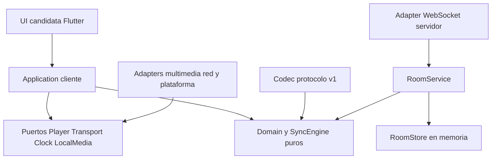

# Arquitectura

Estado: fundaciones conservadas; el Spike A implementa adapters WebSocket,
RoomService, codec y cliente CLI con FakePlayer. Spike B añade un Player libmpv
experimental Linux. El vertical slice 1 integra red + vídeo real con LocalMedia;
Spike C añade UI de ingeniería/bridge aislados; el vertical slice 2 reutiliza
Application para Linux/Android. Product UI Phases 1–2 añaden el shell de producto,
Player Linux embebido, fullscreen y recovery Android; véase [UI](UI.md).
[PRODUCT](PRODUCT.md) delimita v0.1 y [PROTOCOL](PROTOCOL.md)
define el contrato normativo de control. [DECISIONS](DECISIONS.md) registra motivos.

## Separación de responsabilidades



Las flechas indican dependencias de código, no el viaje de un mensaje. El runtime
se compone en la Application; los adapters implementan sus puertos. Se mantiene
un workspace Rust con `cine-core`, `cine-rooms`, `cine-protocol`, `cine-server` y
`cine-client`, más `cine-player-mpv` experimental y `cine-local-media`:
corresponden a responsabilidades que ya se ejecutan y prueban.
No se crean crates por conceptos futuros. `cine-rooms` no depende de
Axum ni Tokio en su API; los DTOs de transferencia compartidos tienen serde sin I/O; `cine-protocol` convierte DTOs a sus comandos. El cliente
compone networking y Application en un runtime experimental, con réplica pura
separada; no se fija todavía un trait async de Transport para la UI futura.

| Módulo | Responsabilidad | Dependencias permitidas |
| --- | --- | --- |
| UI | Presentación y acciones del usuario | API Application; nunca sockets ni política de drift |
| Application cliente | Casos de uso, lifecycle, timers, estado observable y coordinación | Core, puertos, codec; composición de adapters |
| Domain/Core | Identidad de contenido, timeline, orden y decisiones de sync | Biblioteca estándar; ninguna UI/runtime/red |
| Player adapter | Decodificación, superficies, seek, rate, muestras y errores | SDK elegido y puertos; nunca reglas de sala |
| LocalMedia adapter | Handle privado, probe acotado, hashing streaming y descriptor portable | Filesystem/probe/SHA-256 y Core; nunca RoomService |
| Networking adapter | Conexión, TLS, heartbeat, envío y recepción | Runtime/transporte y codec; nunca permisos de sala |
| Codec protocolo | JSON, validación de DTOs, conversión a dominio | Tipos de dominio; no reproductor |
| RoomService servidor | Autorización, readiness, comandos, secuencia y snapshots | Dominio, reloj, store; no sockets |
| Backend adapter | HTTP/WS, sesiones y límites de frontera | Axum/Tokio candidatos, RoomService y codec |

Prohibido: Domain → Flutter/Axum/Tokio/mpv; SyncEngine → Player concreto;
Transport genérico del cliente → política de RoomService; UI → adapter multimedia.
El adapter backend sí compone codec y RoomService, como muestra el diagrama.
El servidor decide autoridad;
el cliente decide cómo ejecutar y corregir localmente.

## Puertos y casos de uso

`Player` existe en [core/src/player.rs](../core/src/player.rs): play, pause, seek,
position, duration y rate con detección de capacidad. No impone `Send`, event
loop ni hilo: algunos SDKs exigen hilo principal. Sus retornos confirman dispatch;
el adapter de Spike B reporta carga/seek completado y buffering fuera del puerto.
Otros adapters futuros deberán mantener esa separación.
Application no asume que seek devuelve con el frame ya mostrado.

Contratos (sin traits async adicionales prematuros):

- `LocalMedia`: resolver un handle del dispositivo, inspeccionar y hashear en
  worker cancelable. En Android/iOS puede ser un URI o recurso con permiso,
  no necesariamente una ruta accesible por Rust.
- `Transport`: connect/disconnect, send de DTO validado y stream de mensajes o
  estado de conexión. No decide joins, reintentos de controles ni permisos.
- `Clock`: monotonic_now, estimación de tiempo del servidor y confianza. No lee
  `SystemTime` dentro de las reglas de sync.
- `RoomService`: create/join/leave/select/ready/control/resume/transfer; recibe
  contexto autenticado del adapter, devuelve efectos y estado, no envía sockets.

No se fija el mecanismo async/FFI hasta el spike de puente. La API de Application
expone comandos tipados y snapshots de presentación; no objetos del reproductor
ni estructuras de Axum. Rust no necesita poseer la superficie de vídeo: se admite
un Player nativo con comandos desde la Application.

## Núcleo implementado

`clock`: muestras NTP conceptuales y filtro de ocho muestras. `playback`: timeline
y transición futura única. `sync`: política configurable que devuelve efectos,
sin ejecutar Player. `replica`: compuerta de secuencia/snapshot/epoch. `media`:
identidad y descriptor sin rutas. `player`: puerto mínimo. Tests independientes
usan reloj y Player falsos. El Spike A añade RoomState/RoomService completo para
el subconjunto de control, DTOs validados, UUIDs/tokens, timers Tokio y scheduler
cliente. SHA-256 se usa para verificadores de tokens/fingerprints de requests,
y el vertical slice añade hashing de archivos en cine-local-media. El comportamiento
del Core original se conserva; PlayerError solo añade
Display/Error de std para propagación tipada en el harness de Spike B.

## Estado autoritativo de sala

```text
RoomState
  room_id, room_epoch, sequence, updated_at_ms
  host_id, authority_revision, permissions(profile="host_only_v1")
  members[] {member_id, display_name, role, connected, ready,
             verified_media_revision?, status, joined_at_ms, lease_expires_at_ms?}
  media? {media_revision, descriptor}
  playback? {current: Timeline, pending?: ScheduledTransition}

Timeline
  status: playing | paused | stopped
  position_ms, anchor_time_ms, rate(1.0 en v1), duration_ms

ScheduledTransition
  command_event_id, sequence, authority_revision, media_revision,
  execute_at_ms, timeline_after: Timeline
```

`room_epoch` y el reloj se ligan a la vida de la sala en ese servidor.
`authority_revision` comienza en 1 y aumenta al transferir Host.
`media_revision` aumenta con cada selección, incluso si el digest se repite.
Ready y timers se ligan a esas revisiones; seleccionar invalida Ready de todos.
`buffering`/`error` son estados por miembro, no estados globales del timeline.
Un cliente lento no cambia el estado global sin decisión del Host.

RoomService procesa mutaciones en serie por sala, valida todo antes de asignar
secuencia y emite un efecto autoritativo por mutación. Un actor/task por sala es
suficiente; no hacen falta microservicios. En este spike un mutex de duración
corta serializa el store completo y el encolado de efectos, sin await dentro:
es una implementación simple del orden por sala. Sharding por sala solo si
una carga medida justifica eliminar esa contención. Solo hay una transición
pendiente;
controles nuevos devuelven `CONTROL_PENDING` hasta su vencimiento. El snapshot
incluye timeline actual y transición pendiente, evitando aplicar anticipadamente
un Play o Pause todavía futuro. Promover una transición vencida es normalización
determinista del estado, no una mutación nueva con secuencia distinta.

Play exige todos los conectados Ready y con identidad exacta; Pause no exige
Ready, aunque debe esperar a vencer una transición pendiente; Seek exige media
seleccionada y mantiene playing/paused.
Cambiar media solo se admite pausado/stopped y sin transición pendiente.
Una nueva entrada no pausa a otros y comienza no preparada. Si ocurre antes de
un Play pendiente, el nuevo miembro espera preparar su copia; no cancela el Play
ya aceptado. No se cambia retroactivamente su conjunto de participantes.

Desconexión: presencia cambia, Ready se borra, lease 30 s; el miembro puede
reanudar con token antes de expirar. Si hay media, Host desconectado provoca
pausa de seguridad programada por el servidor, sustituyendo cualquier transición pendiente; el
snapshot del efecto hace inequívoca la cancelación. El Host conserva su rol en
la gracia. Tras expirar o salir sin transferencia, se cierra la
sala; no hay elección automática en v0.1. Transferencia explícita solo pausado,
sin pending y a un miembro conectado Ready si hay media (conectado basta si no
hay selección); conserva media/timeline, incrementa
authority_revision y cancela solicitudes antiguas. Ver detalles en PROTOCOL.

## Backend y persistencia

Servidor único en memoria; Axum/Tokio y WebSocket implementan este spike
localhost, con colas acotadas de 32 y máximo 256 conexiones/128 salas. RoomStore
futuro podría persistir snapshots y deduplicación,
sin filtrar SQL al dominio. PostgreSQL solo cuando haya necesidad de persistencia
real; Redis solo cuando una carga medida requiera coordinación/cache. Reiniciar
el servidor pierde salas y tokens: el cliente recibe ROOM_NOT_FOUND y crea/une
otra sala. IDs de epoch nunca se reciclan.

## Evolución sin compromisos prematuros

WebRTC futuro transportará voz/cámara/screen sharing y quizá datos P2P; requerirá
señalización autorizada, ICE/STUN/TURN y costes evaluados. El canal autoritativo
de sala seguirá separado. P2P de archivos tendrá chunking, integridad, permisos y
congestión propios. Un hash no autoriza descargar un archivo.

Providers resolverán descriptores a recursos locales al dispositivo; ni la sala
ni SyncEngine conocen credenciales, URLs privadas o APIs de Jellyfin. Fuentes
HTTP/HLS/DASH pueden tener timeline live, duraciones variables y contenido
personalizado: necesitan otra semántica de identidad y capacidades negociadas,
no se habilitan con un simple valor de enum v1. Federación queda en estudio;
mantener una autoridad por sala evita fingir un consenso ya resuelto.

## Adapter aislado de Spike B

[adapters/player-mpv](../adapters/player-mpv/README.md) es el único nuevo módulo
concreto: depende de cine-core y carga libmpv dinámicamente. Application del
harness tiene un owner y bombea eventos; Player permanece !Send/!Sync por decisión
del wrapper, sin imponer threading al puerto. Load y eventos no viven en Domain.
Las mediciones y timers reales quedan en el ejecutable experimental. En el
Spike B no se modificó Replica/FakePlayer ni se conectaron sockets con
multimedia; la integración posterior se describe abajo.
Detalle/evidencia en [experimento 01](../experiments/01-player-crossplatform/README.md).

## Composición del vertical slice 1

`cine-client` selecciona `--player fake|mpv` (fake por defecto). `Replica<P>` usa
`ApplicationPlayer: Player`: tick para reloj falso, vista con readiness/seek/
buffering y timestamp de muestra, marca de medición y capacidad asíncrona. Ese
contrato local de Application no añade SDK, Send/Sync o eventos al puerto del Core.
Una sola réplica, scheduler y SyncEngine sirven a ambos backends.

MpvPlayer permanece !Send/!Sync: un thread `cine-mpv-owner` lo crea, carga,
consulta/polleea y destruye. Un proxy Send-safe comunica comandos por cola
acotada a 32 y publica muestras bajo mutex. Load/probe/hash se esperan en
spawn_blocking sin retener el mutex de sesión; el loop WS usa el proxy, nunca
el SDK. Comandos de control esperan confirmación de dispatch por RPC; seek
completion se observa después, no mediante un sleep arbitrario. El owner se
une al destruir la última referencia. Timeouts de RPC no interrumpen una llamada
C bloqueada: sigue siendo un riesgo de lifecycle, no un sandbox del decoder.

Los snapshots periódicos conservan la corrección suave y el Player actual;
solo media/autoridad nueva, recuperación o transición a Ready reconcilian la
timeline. Una muestra >100 ms vieja no alimenta SyncEngine. La política Core y
sus thresholds no cambian. El servidor, RoomStore y codec no tienen cambios ni
conocen rutas locales. Evidencia en
[vertical slice 1](../experiments/06-real-vertical-slice/README.md).

## Frontera móvil/UI de Spike C

[Experimento 02](../experiments/02-rust-ui-bridge/README.md) prueba una Application
Rust aislada con el SyncEngine original. cine-ui-bridge adapta DTOs JSON v1 a una
ABI C pequeña; structs Core no se exponen. Flutter presenta snapshots y envía
intents. Kotlin/main Looper posee Media3, permiso SAF y SurfaceView en PlatformView.
SDK nativo nunca se envía a Rust ni se marca Send/Sync artificialmente.

C ABI/Flutter no forman parte del cliente CLI Linux ni del servidor. Solo se
reutiliza hashing sobre Read en LocalMedia; checks de estabilidad de filesystem
se conservan. Protocolo/RoomService y SyncEngine no cambian. Capabilities de
Application mínimas: playback_rate/content_uri_input. Android mide seek/READY/
rendered_first_frame separados; no promete precisión de frame por booleano.

Suspend/resume invalida generation, deadline, hash y clock; requiere recuperación.
El prototipo aislado de Spike C usa fixtures de reloj/snapshot offline. El modo
sala del vertical slice 2 incorpora el runtime existente para Ready/resume reales. iOS requiere Mac/Xcode y sigue
como investigación. Evidencia por plataforma en [RESULTS](../experiments/02-rust-ui-bridge/RESULTS.md).

## Application compartida Linux/Android — Vertical slice 2

Client<P> extrae el runtime probado sin duplicar red/clock/réplica/scheduler/Core.
Desktop inyecta BackendPlayer; Android inyecta MobilePlayer, proxy Send-safe de
muestras/efectos, nunca el SDK. El requisito Send está en la composición del
runtime, no en Player/Domain. Descriptor portable entra por attach_media; FD/URI
siguen en LocalMedia/adapter nativo. FakePlayer y CLI se conservan.

Flutter usa intents C ABI; owner Rust Tokio current-thread controla Client.
Kotlin main Looper observa Media3 y drena 32 efectos cada 20 ms mediante JNI;
no conoce protocolo/timeline/autoridad/corrección. UI consulta estado a 2 Hz.
No se exponen structs Rust como ABI ni se cambia el bridge a FRB.

Activity posee el handle y libera el engine aunque Dart dispose no llegue;
Dart dispose async es vía idempotente adicional. Registry remueve handle antes
de cancelar/join fuera de mutex. Suspend invalida generación/clock/deadlines/
Ready; conserva socket, separando foreground recovery de ROOM_RESUME de red.
Recuperación usa clock real + snapshot + hash/load/Ready, sin fixtures offline.
Los fixtures anteriores quedan solo en modo local de Spike C.

Implementación y evidencia física (distinguir ejecuciones aprobadas y fallidas)
en [experimento 07](../experiments/07-linux-android-room/README.md).
No fija Flutter, libmpv o Media3 ni completa v0.1.


## Presentación de vídeo Linux (Phase 2)

La UI desktop usa RealPlayer::embedded (vo=libmpv); la CLI conserva su salida
headless/nativa. El owner Rust continúa ejecutando SDK/control. El runner Linux
adquiere una lease privada del owner por C ABI y presenta mediante Render API en
un worker EGL propio. FlTextureGL copia únicamente píxeles GPU completados a su
textura consumidora. Flutter recibe un ID, resize/clear y estado; no recibe mpv
internals ni frames CPU. Separación, orden de destrucción y límites en ADR-011
[DECISIONS](DECISIONS.md) y [spike](../experiments/10-player-integration/embedding-spike.md).

Android foreground distingue revalidación local de selección explícita. El
Client valida descriptor/identidad de la selección vigente sin publicar un
MEDIA_SELECT_REQUEST. Hash/generation/Ready y reconciliación se conservan. No
se cambia el protocolo ni se persiste una posición Flutter como autoridad.

## Social Experience Phase 1

ADR-012 añade social negociado en el WebSocket existente; no reemplaza RoomService
ni añade dependencias a Core. `rooms::social` posee historial/cuotas autoritativos
sin Tokio/JSON; devuelve efectos sociales acotados. El hub filtra recipients por
capability y encola sin await; serialización/socket permanecen fuera del mutex.
El Client Rust común valida scope/entries, dedup, gap y SOCIAL_STATE. No envía
social a Replica de playback ni modifica SyncEngine/Player/Ready.

Bridge amplía Intent con chat/reaction y proyecta un solo snapshot social junto
al snapshot Application existente. Publicación Rust 100 ms, Flutter 500 ms
conservados; no polling 20 ms ni WebSocket Dart. ReactionOverlay/message list/
unread observan un ValueNotifier independiente; escribir es estado local del
editor. Retención/quotas en [PROTOCOL](PROTOCOL.md). Rust es fuente de verdad;
Flutter solo draft, visibilidad, unread, scroll y animación. Chat no es durable.

## Rich Social Phase 2

[ADR-013](DECISIONS.md) extiende SocialState existente con MessageContent
Text/Gif/System, reply por UUID y reacciones acotadas dentro de cada entry.
No otro historial ni socket. RoomService valida/broadcast; no consulta proveedores.
GIPHY permanece bloqueado por política y por falta de configuración legítima.
Flutter GifProvider y GifSearch aíslan HTTP/debounce/paginación de WebSocket.
Hoy solo FixtureGifProvider explícito produce assets sintéticos locales; default
UnavailableGifProvider informa bloqueo sin afectar texto o Player.

Bridge añade intents message y message_reaction en ambos owners; sin lógica social
Kotlin. Proyección rich_supported, content, reply y reactions llega por el mismo
SocialView/notifier aislado. UTC vive en la entry, nunca en la timeline de control.
Privacidad y recursos se delimitan en ADR y [resultados](../experiments/12-rich-social/RESULTS.md).

## P2P Media Distribution Phase 1

`cine-transfer-model`: control DTO puro sin I/O; `cine-transfer`: TLS/bloques/SHA/
Partial storage en workers propietarios. Client conserva sockets, FD y lifecycle;
RoomService mantiene autorización y señalización sin contenido binario. Flutter
observa progreso y despacha consentimiento/pause/resume/cancel; Kotlin conserva
SAF/Media3 y destino privado. Core/SyncEngine/Player no se sustituyen.

Completado atraviesa LocalMedia/Player/identidad/clock/Ready existentes. TCP/TLS
directo LAN, WSS pin opt-in y límites en [P2P](P2P.md); decisión provisional
ADR-014. NAT/CGNAT/relay se investigan separadamente.

## P2P WAN foundation — Phase 2 provisional

[ADR-015](DECISIONS.md#adr-015--fundamento-wan-aditivo-y-relay-tcp-end-to-end-provisional)
añade Carrier Read+Write/configure/close en Transfer Layer. TCP y stream TLS
exterior reutilizan TLS peer, chunks y Partial. Relay experimental finite empareja
dos conexiones salientes, no almacena ni recibe archivos en claro. Core,
RoomService, Ready, SyncEngine, Player, Flutter y Kotlin conservan autoridad y
responsabilidades. Producto WAN/private signaling/allocation no implementados;
[experimento 14](../experiments/14-p2p-wan/README.md) separa evidencia simulada.
