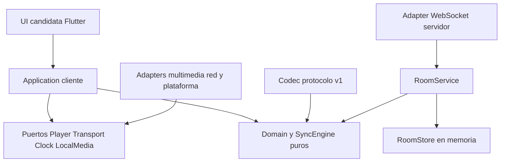

# Arquitectura

Estado: arquitectura adoptada para fundaciones; los adapters y la aplicación no
están implementados. [PRODUCT](PRODUCT.md) delimita v0.1 y [PROTOCOL](PROTOCOL.md)
define el contrato normativo de control. [DECISIONS](DECISIONS.md) registra motivos.

## Separación de responsabilidades



Las flechas indican dependencias de código, no el viaje de un mensaje. El runtime
se compone en la Application; los adapters implementan sus puertos. Se mantiene
un workspace Rust con una sola biblioteca `cine-core` hasta existir otro módulo
ejecutable. No se crean crates separados por cada concepto.

| Módulo | Responsabilidad | Dependencias permitidas |
| --- | --- | --- |
| UI | Presentación y acciones del usuario | API Application; nunca sockets ni política de drift |
| Application cliente | Casos de uso, lifecycle, timers, estado observable y coordinación | Core, puertos, codec; composición de adapters |
| Domain/Core | Identidad de contenido, timeline, orden y decisiones de sync | Biblioteca estándar; ninguna UI/runtime/red |
| Player adapter | Decodificación, superficies, seek, rate, muestras y errores | SDK elegido y puertos; nunca reglas de sala |
| Networking adapter | Conexión, TLS, heartbeat, envío y recepción | Runtime/transporte y codec; nunca permisos de sala |
| Codec protocolo | JSON, validación de DTOs, conversión a dominio | Tipos de dominio; no reproductor |
| RoomService servidor | Autorización, readiness, comandos, secuencia y snapshots | Dominio, reloj, store; no sockets |
| Backend adapter | HTTP/WS, sesiones y límites de frontera | Axum/Tokio candidatos, RoomService y codec |

Prohibido: Domain → Flutter/Axum/Tokio/mpv; SyncEngine → Player concreto;
Transport → RoomService; UI → adapter multimedia. El servidor decide autoridad;
el cliente decide cómo ejecutar y corregir localmente.

## Puertos y casos de uso

`Player` existe en [core/src/player.rs](../core/src/player.rs): play, pause, seek,
position, duration y rate con detección de capacidad. No impone `Send`, event
loop ni hilo: algunos SDKs exigen hilo principal. Sus retornos confirman dispatch;
el adapter futuro reportará carga/seek completado, buffering, muestras y errores.
Application no asume que seek devuelve con el frame ya mostrado.

Contratos diseñados, todavía sin traits adicionales:

- `LocalMedia`: resolver un handle del dispositivo, inspeccionar y hashear en
  worker cancelable. En Android/iOS puede ser un URI o recurso con permiso,
  no necesariamente una ruta accesible por Rust.
- `Transport`: connect/disconnect, send de DTO validado y stream de mensajes o
  estado de conexión. No decide joins, reintentos de controles ni permisos.
- `Clock`: monotonic_now, estimación de tiempo del servidor y confianza. No lee
  `SystemTime` dentro de las reglas de sync.
- `RoomService`: create/join/leave/select/ready/control/resume/transfer; recibe
  contexto autenticado del adapter, devuelve efectos y estado, no envía sockets.

No se fija el mecanismo async/FFI hasta el spike de puente. La API de Application
expone comandos tipados y snapshots de presentación; no objetos del reproductor
ni estructuras de Axum. Rust no necesita poseer la superficie de vídeo: se admite
un Player nativo con comandos desde la Application.

## Núcleo implementado

`clock`: muestras NTP conceptuales y filtro de ocho muestras. `playback`: timeline
y transición futura única. `sync`: política configurable que devuelve efectos,
sin ejecutar Player. `replica`: compuerta de secuencia/snapshot/epoch. `media`:
identidad y descriptor sin rutas. `player`: puerto mínimo. Tests independientes
usan reloj y Player falsos. No están implementados RoomService, RoomState completo,
DTOs JSON, generación de IDs, hashing, timers ni scheduler del sistema operativo.

## Estado autoritativo de sala

```text
RoomState
  room_id, room_epoch, sequence, updated_at_ms
  host_id, authority_revision, permissions(profile="host_only_v1")
  members[] {member_id, display_name, role, connected, ready,
             verified_media_revision?, status, joined_at_ms, lease_expires_at_ms?}
  media? {media_revision, descriptor}
  playback? {current: Timeline, pending?: ScheduledTransition}

Timeline
  status: playing | paused | stopped
  position_ms, anchor_time_ms, rate(1.0 en v1), duration_ms

ScheduledTransition
  command_event_id, sequence, authority_revision, media_revision,
  execute_at_ms, timeline_after: Timeline
```

`room_epoch` y el reloj se ligan a la vida de la sala en ese servidor.
`authority_revision` comienza en 1 y aumenta al transferir Host.
`media_revision` aumenta con cada selección, incluso si el digest se repite.
Ready y timers se ligan a esas revisiones; seleccionar invalida Ready de todos.
`buffering`/`error` son estados por miembro, no estados globales del timeline.
Un cliente lento no cambia el estado global sin decisión del Host.

RoomService procesa mutaciones en serie por sala, valida todo antes de asignar
secuencia y emite un efecto autoritativo por mutación. Un actor/task por sala es
suficiente; no hacen falta microservicios. Solo hay una transición pendiente;
controles nuevos devuelven `CONTROL_PENDING` hasta su vencimiento. El snapshot
incluye timeline actual y transición pendiente, evitando aplicar anticipadamente
un Play o Pause todavía futuro. Promover una transición vencida es normalización
determinista del estado, no una mutación nueva con secuencia distinta.

Play exige todos los conectados Ready y con identidad exacta; Pause no exige
Ready, aunque debe esperar a vencer una transición pendiente; Seek exige media
seleccionada y mantiene playing/paused.
Cambiar media solo se admite pausado/stopped y sin transición pendiente.
Una nueva entrada no pausa a otros y comienza no preparada. Si ocurre antes de
un Play pendiente, el nuevo miembro espera preparar su copia; no cancela el Play
ya aceptado. No se cambia retroactivamente su conjunto de participantes.

Desconexión: presencia cambia, Ready se borra, lease 30 s; el miembro puede
reanudar con token antes de expirar. Si hay media, Host desconectado provoca
pausa de seguridad programada por el servidor, sustituyendo cualquier transición pendiente; el
snapshot del efecto hace inequívoca la cancelación. El Host conserva su rol en
la gracia. Tras expirar o salir sin transferencia, se cierra la
sala; no hay elección automática en v0.1. Transferencia explícita solo pausado,
sin pending y a un miembro conectado Ready si hay media (conectado basta si no
hay selección); conserva media/timeline, incrementa
authority_revision y cancela solicitudes antiguas. Ver detalles en PROTOCOL.

## Backend y persistencia

Servidor único en memoria; Axum/Tokio y WebSocket son la implementación candidata
del primer spike. RoomStore futuro podría persistir snapshots y deduplicación,
sin filtrar SQL al dominio. PostgreSQL solo cuando haya necesidad de persistencia
real; Redis solo cuando una carga medida requiera coordinación/cache. Reiniciar
el servidor pierde salas y tokens: el cliente recibe ROOM_NOT_FOUND y crea/une
otra sala. IDs de epoch nunca se reciclan.

## Evolución sin compromisos prematuros

WebRTC futuro transportará voz/cámara/screen sharing y quizá datos P2P; requerirá
señalización autorizada, ICE/STUN/TURN y costes evaluados. El canal autoritativo
de sala seguirá separado. P2P de archivos tendrá chunking, integridad, permisos y
congestión propios. Un hash no autoriza descargar un archivo.

Providers resolverán descriptores a recursos locales al dispositivo; ni la sala
ni SyncEngine conocen credenciales, URLs privadas o APIs de Jellyfin. Fuentes
HTTP/HLS/DASH pueden tener timeline live, duraciones variables y contenido
personalizado: necesitan otra semántica de identidad y capacidades negociadas,
no se habilitan con un simple valor de enum v1. Federación queda en estudio;
mantener una autoridad por sala evita fingir un consenso ya resuelto.
